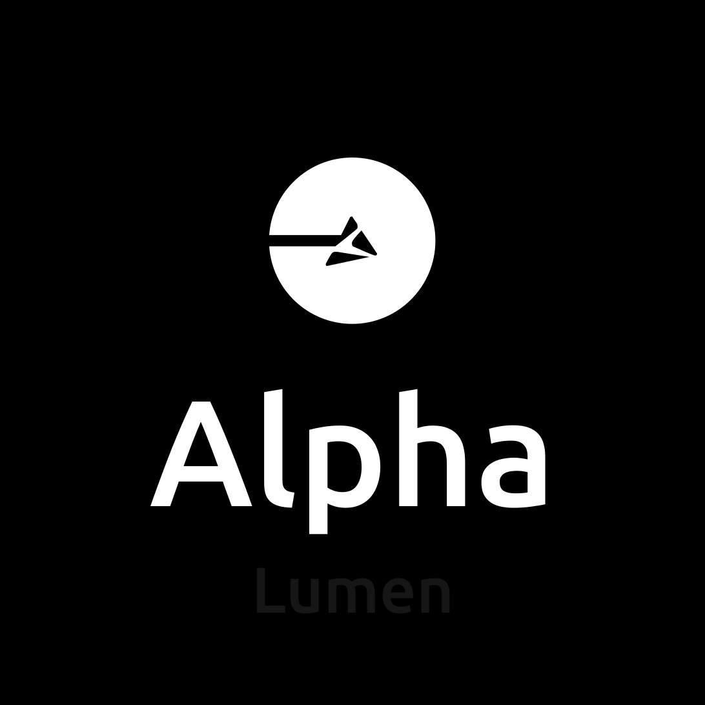

<h1 style="color: #FFFFFF">
  Encouraging free-flow and carbon-free streets.
</h1>

 
 

<h2 >Introducing <Text style="color: #02D06D">Carbon Credits</Text></h2>

The core of Carbon are <Text style="color: #02D06D">Carbon Credits</Text>,  used to track the carbon emission on the atmosphere by the user. Long walks results in earning credits, while using vehicles results in loosing them.

Carbon generate routes and calculate the Carbon Credits moved by it, basing on your vehicle choice.

Carbon also contains a simple shop, for trading your credits for real products; and a social media enviroment to integrate Carbon users around the world.

### Carbon API
We've created a simple REST API for the Carbon app.

https://github.com/alphalumen-hackathon/carbon-api

Features:
  - Authentication
  - Carbon Credits Management
  - Activity Management
  - Social Media Enviroment Management
  - Shop Management

### Tech Stack
- Expo
- React Native
- Zustand
- Google Maps API
- Typescript
- NodeJS
- Express
- Prisma

 
 

<h2>Team Alpha Lumen</h2>

  
  

    <li style="font-weight: bold; font-size: 18">Gabriel Faria</li>
    <li style="font-weight: bold; font-size: 18">Gustavo Carvalho</li>
    <li style="font-weight: bold; font-size: 18">Tiago Trindade</li>
    <li style="font-weight: bold; font-size: 18">Pedro Martineli</li>
  

